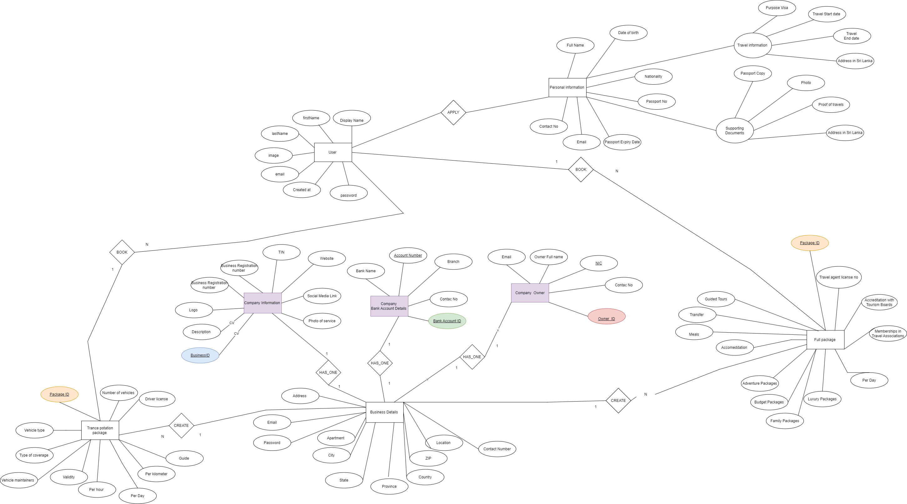
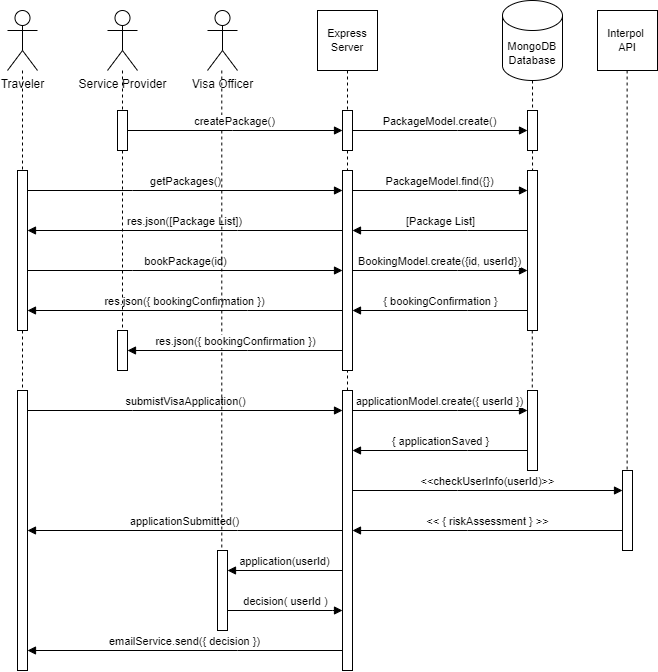

<a id="readme-top"></a>

<!-- PROJECT SHIELDS -->

[![Contributors][contributors-shield]][contributors-url]
[![Forks][forks-shield]][forks-url]
[![Stargazers][stars-shield]][stars-url]
[![Issues][issues-shield]][issues-url]

<!-- PROJECT LOGO -->
<br />
<div align="center">
  <a href="https://github.com/EnigmasRuh/Enigmas_SriLanka_TDA">
    
  </a>

<h3 align="center">Sri Lanka Tourism Development Authority Website</h3>

  <p align="center">
    An innovative solution to elevate Sri Lanka's tourism industry by offering a comprehensive platform for travel services and streamlined visa processing, designed for the Sri Lankan authorities to support and enhance the tourist experience.
    <br />
    <a href="https://github.com/EnigmasRuh/Enigmas_SriLanka_TDA"><strong>Explore the docs »</strong></a>
    <br />
    <br />
    <a href="https://github.com/EnigmasRuh/Enigmas_SriLanka_TDA">View Test</a>
    ·
    <a href="https://github.com/EnigmasRuh/Enigmas_SriLanka_TDA/issues/new?labels=bug&template=bug-report---.md">Report Bug</a>
    ·
    <a href="https://github.com/EnigmasRuh/Enigmas_SriLanka_TDA/issues/new?labels=enhancement&template=feature-request---.md">Request Feature</a>
  </p>
</div>

<!-- TABLE OF CONTENTS -->
<details>
  <summary>Table of Contents</summary>
  <ol>
    <li><a href="#about-the-project">About The Project</a></li>
    <li><a href="#built-with">Built With</a></li>
    <li><a href="#getting-started">Getting Started</a></li>
    <li><a href="#contributing">Contributing</a></li>
    <li><a href="#license">License</a></li>
    <li><a href="#contact">Contact</a></li>
    <li><a href="#acknowledgments">Acknowledgments</a></li>
  </ol>
</details>

<!-- ABOUT THE PROJECT -->

## About the project

![Product Name Screen Shot][product-screenshot]

The Sri Lanka Tourist Development Authority website is a government-level solution aimed at revolutionizing Sri Lanka's tourism industry. As a country rich in cultural heritage, natural beauty, and historical significance, Sri Lanka has the potential to become a global tourism hub. This project is designed to harness modern technology and artificial intelligence to propel the nation's tourism sector to new heights.

The website offers a platform for local travel services to register and create diverse packages that cater to various tourist interests. Foreign travelers can easily access, view, and select from these packages, ensuring a seamless and personalized experience.

A key feature of this solution is the streamlined visa processing system, which simplifies and digitizes the entire process. From visa form submission to risk assessment using publicly available Interpol Notices APIs, the system is designed to enhance efficiency, security, and transparency. Visa officers can easily manage applications, approve or deny them based on comprehensive data, and notify users of their visa status via email. Additionally, the system provides valuable insights to government authorities through visualized historical data and analytics, enabling informed decision-making and continuous improvement in the visa processing workflow.

<p align="right">(<a href="#readme-top">back to top</a>)</p>

## Features

- **Travel Service Registration:** Platform for travel services to register and create customizable packages.
- **User-Friendly Package Selection:** Foreign users can browse and select from a variety of travel packages.
- Streamlined Visa Processing:
- - **Visa Form Submission:** Input fields for personal information, passport bio page upload, passport-sized photograph upload, and travel history of the last 12 months.
- - **Visa Officer Interface:** Interface for visa officers to review and manage applications.
- - **Risk Assessment:** Integration with publicly available Interpol Notices APIs to identify risky applicants.
- - **Email Notifications:** Automatic notifications sent to users regarding their visa application status.
- - **Analytics and Visualization:** Historical data analysis and visualization to provide insights for government authorities.

#### ER diagram



#### Sequence diagram



### Built With

Add others according to your tech stack:

- ![React][React.js]
- ![TailwindCSS][TailwindCSS]
- ![JWT][JWT]
- ![MongoDB][MongoDB]

<p align="right">(<a href="#readme-top">back to top</a>)</p>

<!-- GETTING STARTED -->

## Getting Started

To get started with the Book Social Network project, follow the setup instructions in the respective directories:

Clone the repository:

```bash
   git clone https://github.com/EnigmasRuh/Enigmas_SriLanka_TDA
```

- [Backend Setup Instructions](Frontend/README.md)
- [Frontend Setup Instructions](Backend/README.md)

<!-- CONTRIBUTING -->

## Contributing

Contributions are what make the open source community such an amazing place to learn, inspire, and create. Any contributions you make are **greatly appreciated**.

If you have a suggestion that would make this better, please fork the repo and create a pull request. You can also simply open an issue with the tag "enhancement".
Don't forget to give the project a star! Thanks again!

1. Fork the Project
2. Create your Feature Branch (`git checkout -b feature/AmazingFeature`)
3. Commit your Changes (`git commit -m 'Add some AmazingFeature'`)
4. Push to the Branch (`git push origin feature/AmazingFeature`)
5. Open a Pull Request

<!-- LICENSE -->

## License

Distributed under the MIT License. See `LICENSE.txt` for more information.

<p align="right">(<a href="#readme-top">back to top</a>)</p>

<!-- CONTACT -->

## Contact

Your name - [LinkedIn](linkedin URL)

<!-- ACKNOWLEDGMENTS -->

## Acknowledgments

Your acknowledgements

<p align="right">(<a href="#readme-top">back to top</a>)</p>

<!-- MARKDOWN LINKS & IMAGES -->
<!-- https://www.markdownguide.org/basic-syntax/#reference-style-links -->

[contributors-shield]: https://img.shields.io/github/contributors/EnigmasRuh/Enigmas_SriLanka_TDA.svg?style=for-the-badge
[contributors-url]: https://github.com/EnigmasRuh/Enigmas_SriLanka_TDA/graphs/contributors
[forks-shield]: https://img.shields.io/github/forks/EnigmasRuh/Enigmas_SriLanka_TDA.svg?style=for-the-badge
[forks-url]: https://github.com/EnigmasRuh/Enigmas_SriLanka_TDA/network/members
[stars-shield]: https://img.shields.io/github/stars/EnigmasRuh/Enigmas_SriLanka_TDA.svg?style=for-the-badge
[stars-url]: https://github.com/EnigmasRuh/Enigmas_SriLanka_TDA/stargazers
[issues-shield]: https://img.shields.io/github/issues/EnigmasRuh/Enigmas_SriLanka_TDA.svg?style=for-the-badge
[issues-url]: https://github.com/EnigmasRuh/Enigmas_SriLanka_TDA/issues
[product-screenshot]: images/screenshot.png
[React.js]: https://img.shields.io/badge/React-20232A?style=for-the-badge&logo=react&logoColor=61DAFB
[TailwindCSS]: https://img.shields.io/badge/tailwindcss-%2338B2AC.svg?style=for-the-badge&logo=tailwind-css&logoColor=white
[JWT]: https://img.shields.io/badge/JWT-black?style=for-the-badge&logo=JSON%20web%20tokens
[JWT-url]: https://jwt.io/
[MongoDB]: https://img.shields.io/badge/MongoDB-%234ea94b.svg?style=for-the-badge&logo=mongodb&logoColor=white
